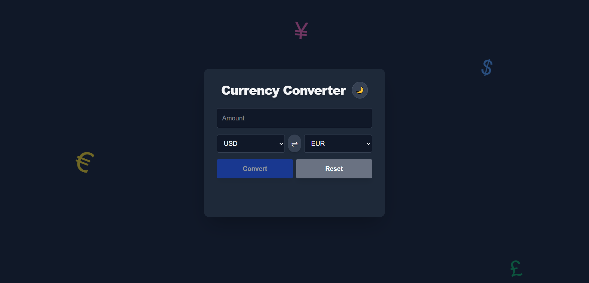

# Currency Converter



A modern, responsive currency converter built with Next.js, Typescript and Tailwind CSS. Supports light/dark themes and animated currency backgrounds.

🔗 **Live Demo:** [currency-converter-wfzp.vercel.app](https://currency-converter-wfzp.vercel.app/)  
📂 **GitHub Repository:** [github.com/MohamadAlhussain/Currency-Converter](https://github.com/MohamadAlhussain/Currency-Converter)

## Features

- Real-time currency conversion using CurrencyFreaks API
- Light and dark theme toggle
- Animated floating currency symbols
- Responsive and accessible UI

## Technologies Used

- Next.js 13 (App Router)
- React 18
- TypeScript
- Tailwind CSS
- CurrencyFreaks API
- Vercel (Deployment)

## Getting Started

### Prerequisites

- Node.js 18+
- npm or yarn

### Installation

1. Clone the repository:
   ```bash
   git clone https://github.com/MohamadAlhussain/Currency-Converter.git
   cd currency-converter
   ```
2. Install dependencies:
   ```bash
   npm install
   # or
   yarn install
   ```
3. Create a `.env` file in the root directory and add your CurrencyFreaks API key:
   ```env
   CURRENCY_API_KEY=your_real_api_key_here
   ```

### Running Locally

```bash
npm run dev
# or
yarn dev
```

The app will be available at [http://localhost:3000]

## How to Use the App

1. Select the source and target currencies from the dropdown menus.
2. Enter the amount you wish to convert.
3. The converted value will update in real time as you type or change currencies.
4. Use the theme toggle to switch between light and dark modes.

## Deployment

This project is deployed on Vercel: https://currency-converter-wfzp.vercel.app/:

To deploy your own version:

1. Push your code to a GitHub (or other git) repository.
2. Import your project into Vercel.
3. In the Vercel dashboard, add the environment variable `CURRENCY_API_KEY` with your API key value.
4. Deploy your project.

## Environment Variables

- `CURRENCY_API_KEY` — Your CurrencyFreaks API key. Required for fetching currency rates.

## Security

- The API key is securely stored in environment variables and only used in server-side API routes.
- No sensitive information is exposed to the client.

## What I Learned

- Integrating third-party APIs securely in a Next.js application
- Managing environment variables and protecting sensitive data
- Building responsive, accessible UIs with Tailwind CSS
- Implementing animated backgrounds with React and CSS
- Deploying full-stack applications to Vercel

Built with ❤️ by Mohamad Alhussain
